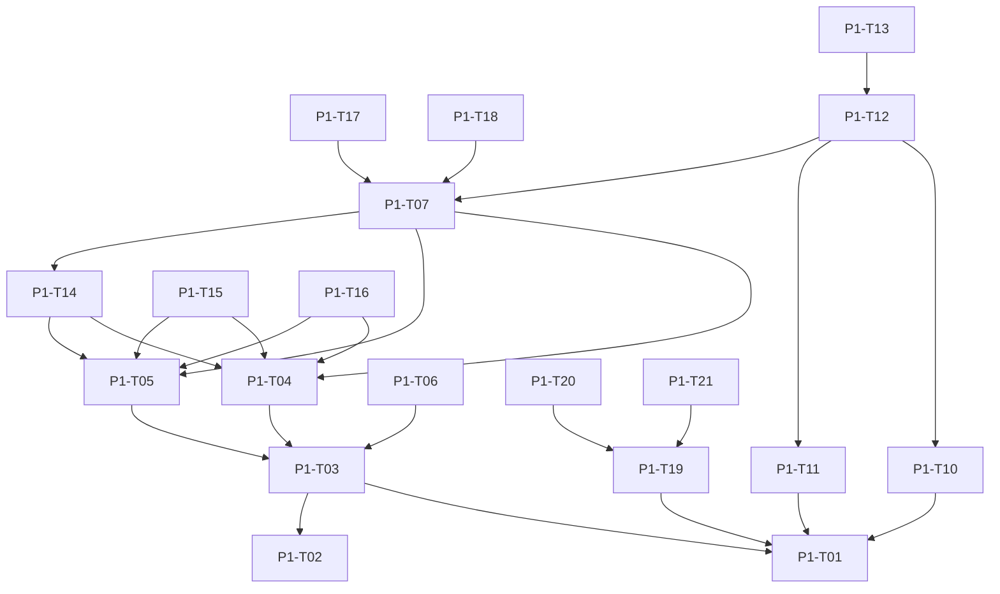

# Phase 1: Invisible Intelligence — Build Plan

## Overview
Phase 1 focuses on the core intelligence and orchestration of Verve. It establishes the infrastructure, the local memory vault with Trust Ladder enforcement, the Intent Engine (RAG, Ambiguity Resolution), and the voice loop. The goal is to achieve a voice-to-TTS round trip in under 1.2s.

## Task List

### Week 1 — Infrastructure
- **P1-T01:** Go Orchestrator skeleton (WebSocket server, session state machine). Builder: `verve-backend-builder`
- **P1-T02:** Python FastAPI Intent Engine (health endpoint, Whisper stub, LLM stub). Builder: `verve-backend-builder`
- **P1-T03:** Mono-repo scaffold (Flutter, Go, Python, Node.js directories). Builder: `verve-conductor`

### Week 2 — The Memory Vault
- **P1-T04:** SQLite-VEC integration (schema with trust_level_required column). Builder: `verve-edge-builder`
- **P1-T05:** CRUD for local embeddings (save, retrieve, reinforce, delete). Builder: `verve-edge-builder`
- **P1-T06:** SQLCipher encryption with Keystore/Secure Enclave. Builder: `verve-edge-builder`
- **P1-T14:** Trust Ladder data access enforcement in SQLite-VEC queries. Builder: `verve-edge-builder`
- **P1-T15:** Temporal decay pruning (90-day archive threshold). Builder: `verve-edge-builder`
- **P1-T16:** DB corruption recovery (integrity check → cloud restore → Day 1 reset). Builder: `verve-edge-builder`

### Week 3 — The Brain
- **P1-T07:** RAG prompt pipeline with Trust Ladder context gating. Builder: `verve-backend-builder`
- **P1-T08:** Temporal reference resolution ("Monday" → SKU lookup). Builder: `verve-backend-builder`
- **P1-T09:** Dietary constraint enforcement (allergen interception). Builder: `verve-backend-builder`
- **P1-T17:** Ambiguity Resolution engine (vague, contradiction, emotional state). Builder: `verve-backend-builder`
- **P1-T18:** MoE LLM router (simple → fast model <200ms, complex → large model). Builder: `verve-backend-builder`

### Week 4 — The Voice Loop
- **P1-T10:** PCM audio capture pipeline (Flutter → C++ FFI → WebSocket). Builder: `verve-flutter-builder`
- **P1-T11:** Whisper transcription with confidence threshold (<60% → retry). Builder: `verve-backend-builder`
- **P1-T12:** Complete round-trip loop (Voice → Transcription → Inference → TTS). Builder: `verve-backend-builder`
- **P1-T13:** Optimize round-trip latency (target: <1.2s P95). Builder: `verve-backend-builder`
- **P1-T19:** Circuit breaker skeleton (per-service breakers in Go Orchestrator). Builder: `verve-backend-builder`
- **P1-T20:** Redis session state snapshots (5-second intervals). Builder: `verve-backend-builder`
- **P1-T21:** Session crash recovery (reconnect with session_id → Redis restore). Builder: `verve-backend-builder`

## Dependency Graph

## Success Metrics
- Voice-to-TTS round trip < 1.2s (P95)
- RAG recall accuracy > 90%
- SQLite-VEC query latency < 50ms
- Whisper accuracy (Nigerian English) > 90%

## Acceptance Gate
- [ ] Mono-repo scaffolded
- [ ] Go Orchestrator running with WebSocket and Session management
- [ ] FastAPI Intent Engine running
- [ ] SQLite-VEC integrated and functional with encryption, Trust Ladder enforcement, pruning, recovery
- [ ] Full voice loop integrated
