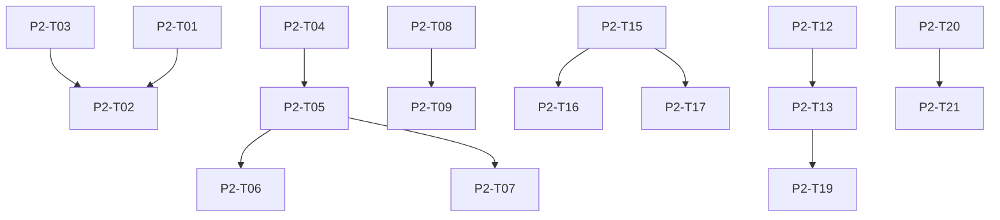

# Phase 2: Visual Stage — Build Plan

## Overview
Phase 2 focuses on the visual representation of Verve, building the consumer-facing Flutter UI. This phase constructs the Morphing Viewport, implements the Breathing Wave shader, creates the Bootstrap Dialogue (Cold Start), integrates Verve+ subscription surfaces, and builds the UI layers representing the Trust Ladder and Ambiguity Resolution.

## Task List

### Week 5 — State & Structure
- **P2-T01:** Riverpod state management architecture. Builder: `verve-flutter-builder`
- **P2-T02:** Morphing Viewport widget stack. Builder: `verve-flutter-builder`
- **P2-T03:** Design system tokens (Teal, Amber, Emerald, Cyan). Builder: `verve-flutter-builder`

### Week 6 — The Visual Synapse
- **P2-T04:** Intent Engine → JSON UI-Metadata (Synapse Payload). Builder: `verve-backend-builder`
- **P2-T05:** Audio-Metadata Sync Listener (tts_position_ms → ui transition). Builder: `verve-flutter-builder`
- **P2-T06:** Hero Card state (parallax, overlays, swipe gestures). Builder: `verve-flutter-builder`
- **P2-T07:** Proposal state (overlapping cards, Z-index, Guardian Shield). Builder: `verve-flutter-builder`

### Week 7 — Aura Identity & Trust UI
- **P2-T08:** Breathing Wave GLSL shader (4 states) — full + lite variants. Builder: `verve-flutter-builder`
- **P2-T09:** Pre-compile shaders via Impeller pipeline. Builder: `verve-flutter-builder`
- **P2-T10:** Haptic feedback system. Builder: `verve-flutter-builder`
- **P2-T11:** Auditory cues (Wake, Synapse, Confirmation). Builder: `verve-flutter-builder`
- **P2-T15:** Bootstrap Dialogue screen (Day 1 onboarding — 90s voice calibration). Builder: `verve-flutter-builder`
- **P2-T16:** Neighborhood Starter Basket screen (cold start fallback). Builder: `verve-flutter-builder`
- **P2-T17:** Trust Ladder display in Guardian Vault (level + data breakdown). Builder: `verve-flutter-builder`
- **P2-T18:** Emotional State visual feedback (Execution/Discovery/Precision modes). Builder: `verve-flutter-builder`

### Week 8 — Adaptive Fidelity & Subscription
- **P2-T12:** Network monitoring background isolate. Builder: `verve-flutter-builder`
- **P2-T13:** Adaptive Fidelity Engine (high-res → SVG at >400ms or 3G). Builder: `verve-flutter-builder`
- **P2-T14:** TTS bitrate downgrade for low bandwidth. Builder: `verve-flutter-builder`
- **P2-T19:** Connection-degraded UI states (Amber pulse, "Aura is thinking...", offline dim). Builder: `verve-flutter-builder`
- **P2-T20:** Verve+ subscription card in Payments screen. Builder: `verve-flutter-builder`
- **P2-T21:** Verve+ natural nudge logic (Aura surfaces savings after 4+ orders). Builder: `verve-flutter-builder`
- **P2-T22:** Cold Start Pantry ("Popular in Your Area" with personalization label). Builder: `verve-flutter-builder`

## Dependency Graph

## Success Metrics
- UI frame rate > 60fps sustained (120fps target)
- Cold start to Idle Wave < 1.5s
- Battery < 2% per 5-min session
- Visual Synapse sync within 50ms of TTS word
- Adaptive Fidelity triggers correctly on simulated 3G
