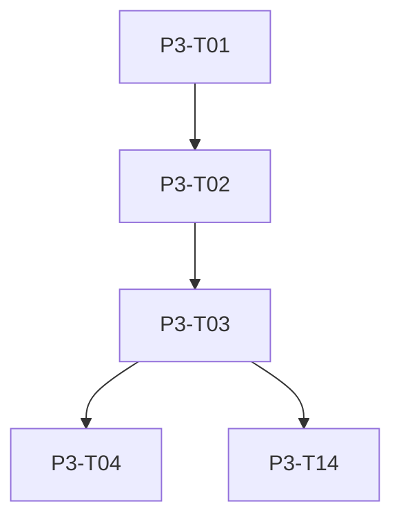

# Phase 3: Nexus Pilot — Build Plan

## Overview
Phase 3 establishes the physical reality layer. It builds the Node.js/GraphQL Nexus API, the PoF (Probability of Fulfillment) engine, integrates routing logic preventing split orders, maps the rider operations application, standardizes the Bio-Handshake, and enforces all 10 Chaos Protocols required for delivery execution.

## Task List

### Week 9 — Nexus API Foundation
- **P3-T01:** Node.js/GraphQL Nexus API skeleton. Builder: `verve-nexus-builder`
- **P3-T02:** PostgreSQL schema + Redis caching layer. Builder: `verve-nexus-builder`
- **P3-T03:** PoF engine with Redis desync detection and recovery. Builder: `verve-nexus-builder`
- **P3-T04:** Wire Intent Engine → Nexus API inventory queries. Builder: `verve-backend-builder`
- **P3-T14:** Single-Hub routing policy enforcement (no split orders). Builder: `verve-nexus-builder`

### Week 10 — Payments
- **P3-T05:** Paystack integration (primary). Builder: `verve-backend-builder`
- **P3-T06:** Flutterwave integration (secondary). Builder: `verve-backend-builder`
- **P3-T07:** Payment Cascade Router (16s total timeout, 4 levels). Builder: `verve-backend-builder`
- **P3-T08:** Verve Wallet (pre-funded NGN balance). Builder: `verve-backend-builder`
- **P3-T15:** Pay-on-Delivery fallback via Bio-Handshake terminal. Builder: `verve-nexus-builder`

### Week 11 — Rider & Delivery
- **P3-T09:** Rider Pulse App (lightweight Flutter — dispatch, navigation, earnings) & FFI Stub removal. Builder: `verve-nexus-builder`
- **P3-T10:** Bio-Handshake protocol (Level 0: full BLE + Visual TOTP). Builder: `verve-nexus-builder`
- **P3-T11:** GIS Canvas state (dark map, rider chevron, traffic heatmap). Builder: `verve-flutter-builder`
- **P3-T12:** Frosted Receipt overlay. Builder: `verve-flutter-builder`
- **P3-T16:** Degraded Bio-Handshake cascade (Levels 1-3: Visual, OTP, Callback). Builder: `verve-nexus-builder`
- **P3-T17:** Rider SOS protocol (3-second hold, GPS broadcast, delivery freeze). Builder: `verve-nexus-builder`
- **P3-T18:** Rider compensation engine (base + delivery + surge + perfect week). Builder: `verve-nexus-builder`
- **P3-T19:** Route safety enforcement (ban zones, night cutoff, weather lockout). Builder: `verve-nexus-builder`
- **P3-T20:** Rider shift manager (8h max, mandatory break at 4h). Builder: `verve-nexus-builder`

### Week 12-13 — Chaos Protocols
- **P3-T21:** Chaos Protocol 5.1: Spoilage Swap. Builder: `verve-nexus-builder`
- **P3-T22:** Chaos Protocol 5.2: Traffic Gridlock Reroute. Builder: `verve-nexus-builder`
- **P3-T23:** Chaos Protocol 5.3: Power Grid Failure (IoT temp → PoF zero). Builder: `verve-nexus-builder`
- **P3-T24:** Chaos Protocol 5.4: Rider Device Failure (degraded handshake dispatch). Builder: `verve-nexus-builder`
- **P3-T25:** Chaos Protocol 5.5: User Not Home (cold-hold return). Builder: `verve-nexus-builder`
- **P3-T26:** Chaos Protocol 5.6: Fleet Immobilization (fuel scarcity mode). Builder: `verve-nexus-builder`
- **P3-T27:** Chaos Protocol 5.7: Hub Flooding (zone lockout). Builder: `verve-nexus-builder`
- **P3-T28:** Chaos Protocol 5.8: Coordinated Fraud (velocity model). Builder: `verve-nexus-builder`
- **P3-T29:** Chaos Protocol 5.9: Picker Walkout (ticket redistribution). Builder: `verve-nexus-builder`
- **P3-T30:** Chaos Protocol 5.10: Holiday Surge (pre-staging). Builder: `verve-nexus-builder`

### Week 14 — Beta & Observability
- **P3-T13:** 50 closed-beta provisioning events. Builder: `verve-verifier`
- **P3-T31:** Observability pipeline (Prometheus + Grafana + Loki + Jaeger). Builder: `verve-backend-builder`
- **P3-T32:** Alerting thresholds (5 metrics: LLM latency, WS errors, payment depth, PoF desync, crashes). Builder: `verve-backend-builder`
- **P3-T33:** Distributed tracing across Go → Python → Node.js. Builder: `verve-backend-builder`

## Dependency Graph

## Success Metrics
- 50+ closed-beta deliveries
- PoF accuracy > 95%
- Payment cascade success > 99%
- Bio-Handshake Level 0 success > 95%
- Order-to-delivery < 15 min (P80, 5km)
