<p align="center">
  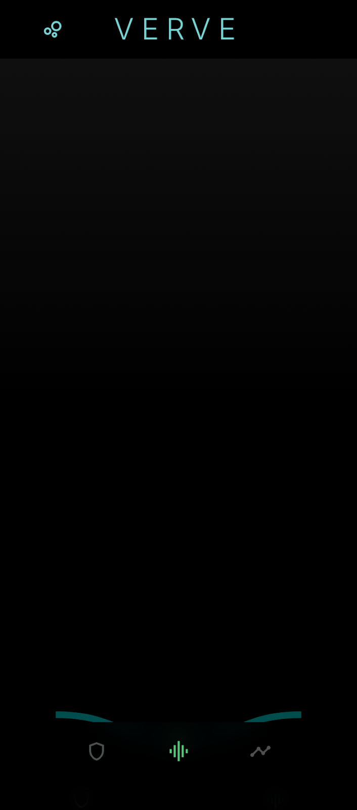
</p>

<h1 align="center">VERVE</h1>

<p align="center">
  <strong>Cognitive Commerce for Africa</strong><br/>
  <em>Provisioning as a Service — powered by Aura, your Intent-Agent</em>
</p>

<p align="center">
  <a href="LICENSE"></a>
  
  
  
  
  
</p>

---

## What Is Verve?

Verve shifts the paradigm from **"Shopping as a Task"** to **"Provisioning as a Service."**

It replaces the digital storefront — the cluttered grids, unreliable search bars, and endless scrolling — with **Aura**, an AI Intent-Agent. Users don't browse. They *converse*. Aura understands what you need, remembers what you bought, knows what's in your fridge, and handles the chaos of Nigerian retail logistics so you don't have to.

Verve is a **Cognitive Commerce Layer**: a single, high-trust digital relationship backed by localized Micro-Fulfillment Centers (MFCs) that deliver within 15 minutes.

> *"The true luxury in 2026 is not access to goods — it's the complete offloading of routine logistical thought to a hyper-competent proxy."*

---

## The Vision

<table>
<tr>
<td width="50%">

### The Problem

In Nigeria's digital commerce landscape, shopping apps are high-friction utilities. Users must navigate unreliable search, manage cognitive overload, and endure the "Anxiety Gap" between digital promise and physical delivery — battling traffic gridlocks, erratic power, and supply chain inconsistencies.

</td>
<td width="50%">

### The Verve Thesis

Replace the storefront with a voice-first AI partner. One that remembers your dietary restrictions, anticipates your needs before you speak them, ensures every item physically exists in your local hub before suggesting it, and delivers it to your door with a cryptographic handshake — no SMS codes, no verbal exchanges.

</td>
</tr>
</table>

---

## What Makes Verve Different

### 🧠 The Trust Ladder

Aura doesn't demand your data upfront. Trust is earned through a 4-stage escalation:

| Level | Name | What Aura Knows | How It's Earned |
|-------|------|-----------------|-----------------|
| 0 | **Stranger** | Nothing personal — hub popularity only | Default at signup |
| 1 | **Acquaintance** | Recent orders, basic preferences | After first purchase |
| 2 | **Confidant** | Dietary profile, household size, depletion model | After 5+ orders + explicit opt-in |
| 3 | **Partner** | Everything — voice patterns, address, auto-provisioning | After 15+ orders + biometric consent |

Demotion is instant. No guilt messaging. No "Are you sure?" If you revoke access, Aura forgets immediately.

### 🎯 Ambiguity Resolution

Aura doesn't interrogate. When you say *"I dunno, surprise me"*, Aura synthesizes your day-of-week patterns, weather, fridge depletion model, and time-of-day to propose a confident hypothesis. When you say *"healthy stuff"* but your history shows comfort food, Aura proposes a bridge — never judges.

**The Anti-Interrogation Rule:** Maximum one clarifying question per turn. If still ambiguous, commit to a proposal.

### 💰 Revenue Architecture

Verve isn't just an engineering vision — it's a business:

| Stream | Model |
|--------|-------|
| **Transaction Fee** | 3-5% per provisioning event |
| **Verve+** | ₦4,999/month subscription (priority dispatch, extended hours, savings) |
| **Partner Commission** | 8-15% from MFC suppliers |
| **Float Income** | Interest on pre-funded Verve Wallet balances |
| **B2B Anonymized Data** | Aggregate demand intelligence for suppliers |

### 🌪️ Chaos Engineering for Lagos

10 explicit chaos protocols handle the realities of Nigerian infrastructure:

| Protocol | What It Handles |
|----------|----------------|
| Spoilage Swap | Picker finds rotten produce → auto-substitute |
| Traffic Gridlock | Rider stuck > 5 min → re-route via secondary roads |
| Power Grid Failure | NEPA cuts power → IoT sensors detect temp spike → PoF drops to zero |
| Rider Device Failure | Phone dies mid-delivery → degraded handshake + backup rider |
| User Not Home | Bio-Handshake timeout → cold-hold return to hub |
| Fleet Immobilization | Fuel scarcity → extend all ETAs + Verve+ priority |
| Hub Flooding | Rainy season → zone lockout from fulfillment engine |
| Coordinated Fraud | Order-and-cancel attacks → velocity detection + wallet-only mode |
| Picker Walkout | Mid-shift departure → ticket redistribution |
| Holiday Surge | Pre-stage inventory 48 hours ahead |

---

## Core Experience

### The Zero-Click Canvas

Verve's interface has no search bar, no tab bar, and no product grid:

| Zone | Purpose |
|------|---------|
| **Morphing Viewport** (Top 60%) | A fluid canvas that transforms based on what Aura is saying |
| **Sentinel Zone** (Bottom 40%) | The Aura "Breathing Wave" — a GLSL shader pulsing with conversation state |

<p align="center">
  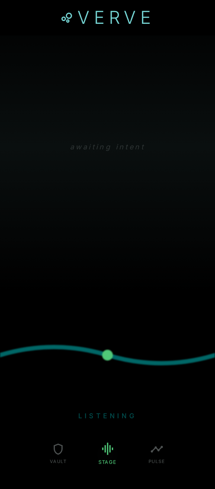
  &nbsp;&nbsp;
  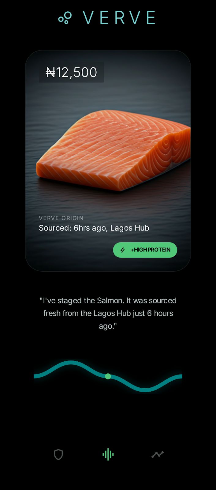
  &nbsp;&nbsp;
  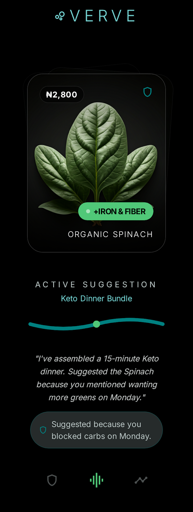
</p>
<p align="center">
  <em>Left: The Void (launch state) · Center: Hero Card (product mention) · Right: The Proposal (recipe bundle)</em>
</p>

### The Visual Synapse

When Aura says *"I've staged the Salmon"*, the salmon appears on screen at the *exact millisecond* the word is spoken. Audio and UI are synchronized via timestamped metadata payloads.

<p align="center">
  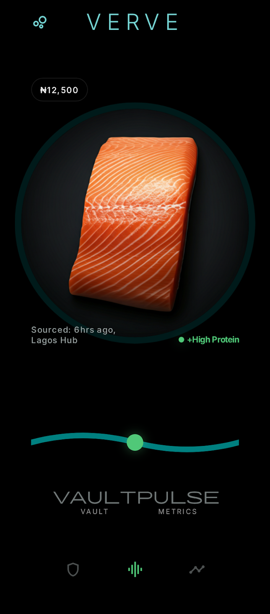
  &nbsp;&nbsp;
  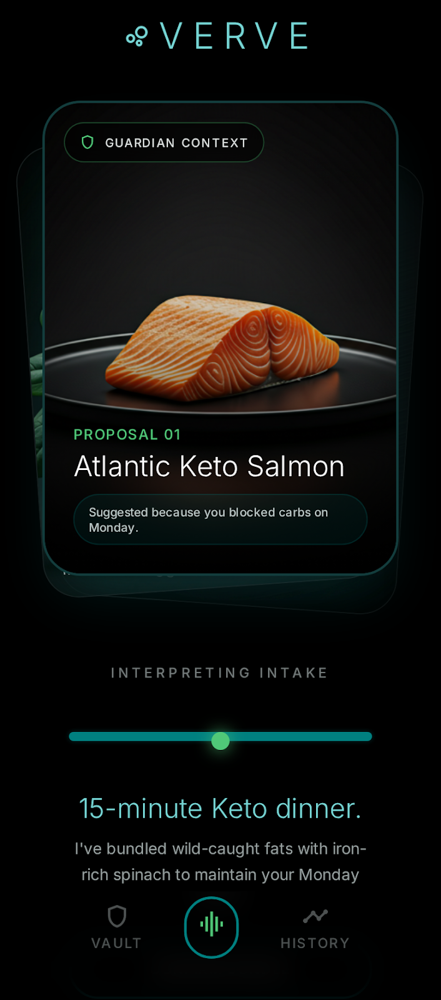
</p>
<p align="center">
  <em>Left: Macro hero card with gyroscope parallax · Right: Keto dinner proposal with vitality scores</em>
</p>

### Real-Time Fulfillment & Bio-Handshake

<p align="center">
  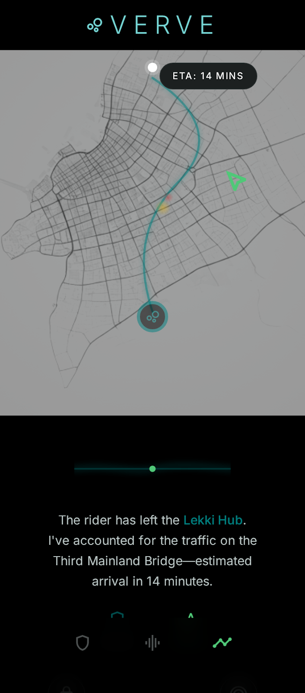
  &nbsp;&nbsp;
  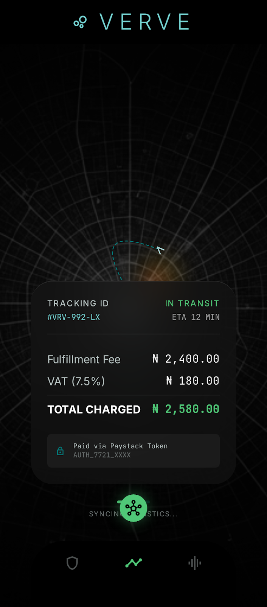
  &nbsp;&nbsp;
  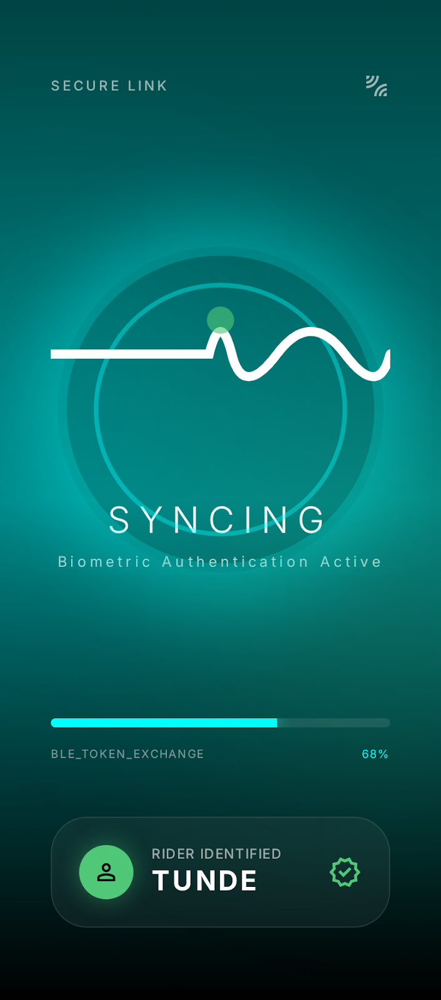
</p>

The Bio-Handshake uses a **4-level cascade** — BLE cryptography (Level 0), visual color pulse (Level 1), OTP (Level 2), or hub callback (Level 3). If one method fails, the system auto-escalates. No delivery is ever unverifiable.

---

## Key Screens

### Onboarding: The Bootstrap Dialogue

A 90-second voice conversation that calibrates Aura without feeling like a form. No payment requested on Day 1 — trust is earned first.

<p align="center">
  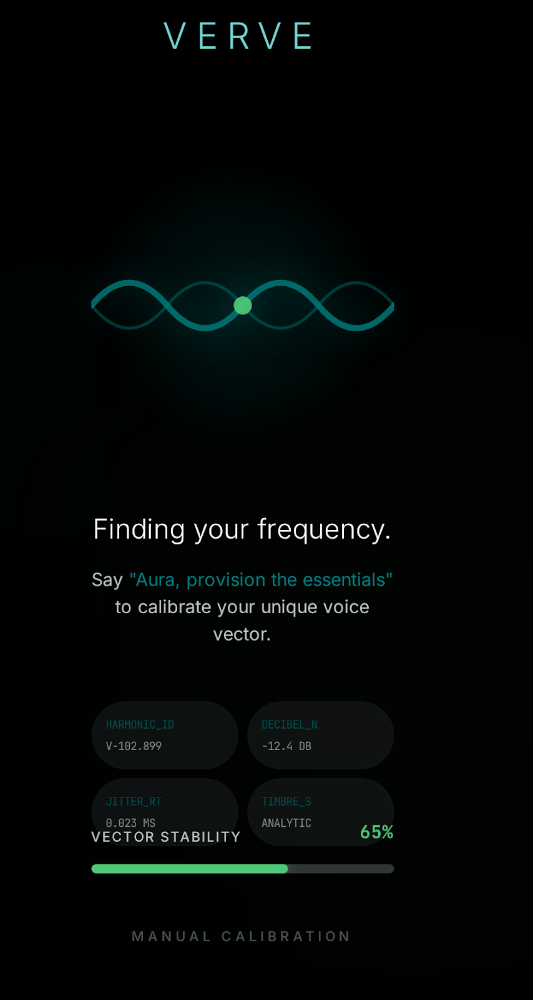
  &nbsp;&nbsp;
  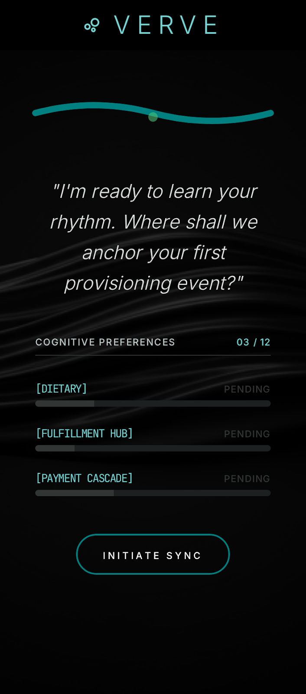
  &nbsp;&nbsp;
  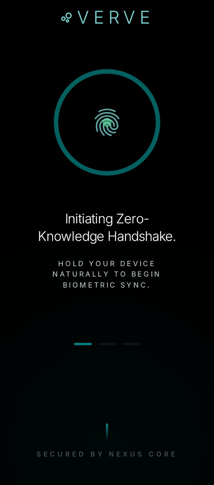
  &nbsp;&nbsp;
  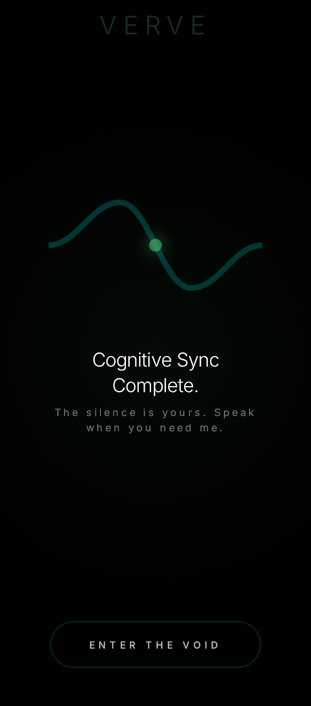
</p>

### Management Screens

<p align="center">
  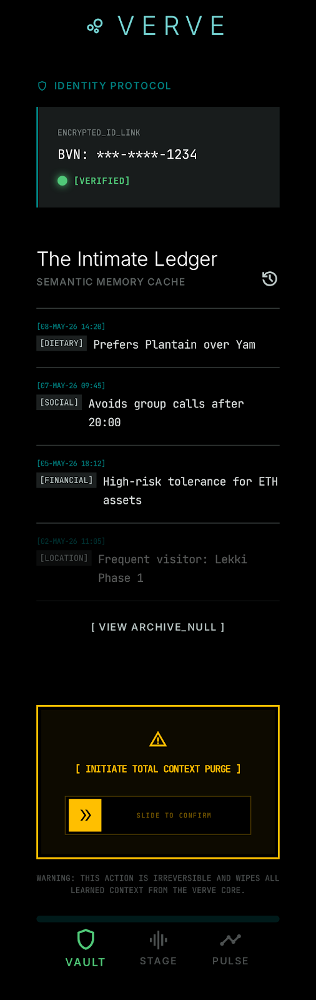
  &nbsp;&nbsp;
  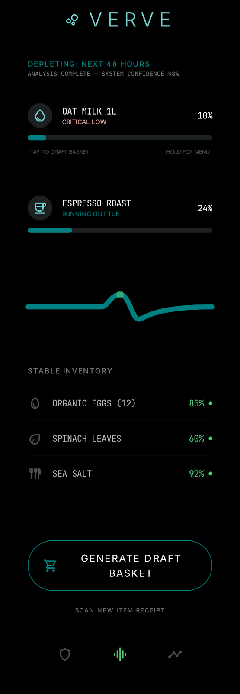
  &nbsp;&nbsp;
  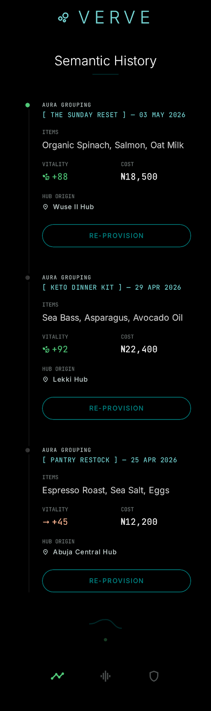
  &nbsp;&nbsp;
  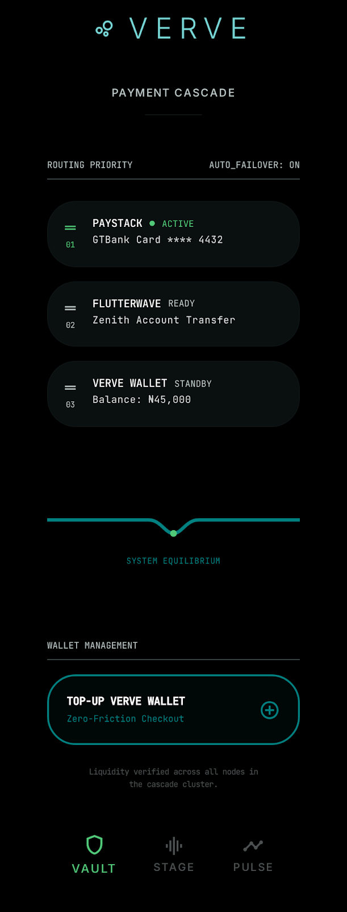
</p>

| Screen | Purpose |
|--------|---------|
| **Guardian Vault** | Privacy dashboard with Trust Ladder level display. View, delete, or purge everything Aura knows. |
| **Predictive Pantry** | See what Aura thinks you're running low on. Tap to reorder. Long-press to correct the AI. |
| **Semantic History** | Orders organized by meaning, not dates. *"The Sunday Reset"* instead of *"Order #1042"*. |
| **Payment Cascade** | Drag-and-drop payment fallback: Paystack → Flutterwave → Wallet → Pay-on-Delivery. |

### Escalation & Edge Cases

<p align="center">
  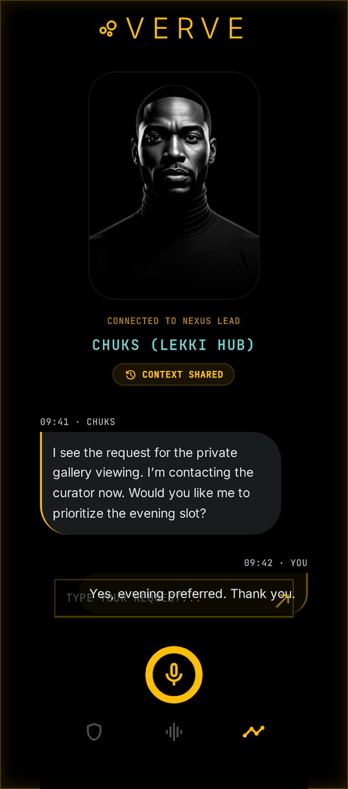
  &nbsp;&nbsp;
  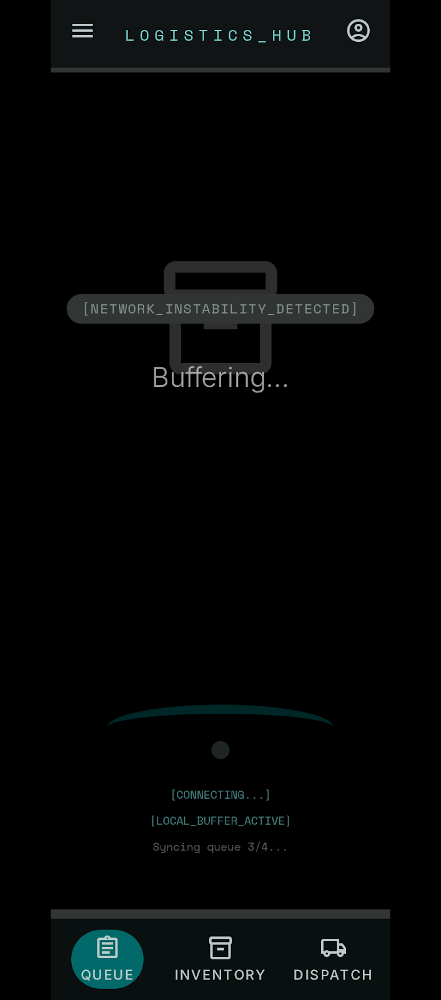
  &nbsp;&nbsp;
  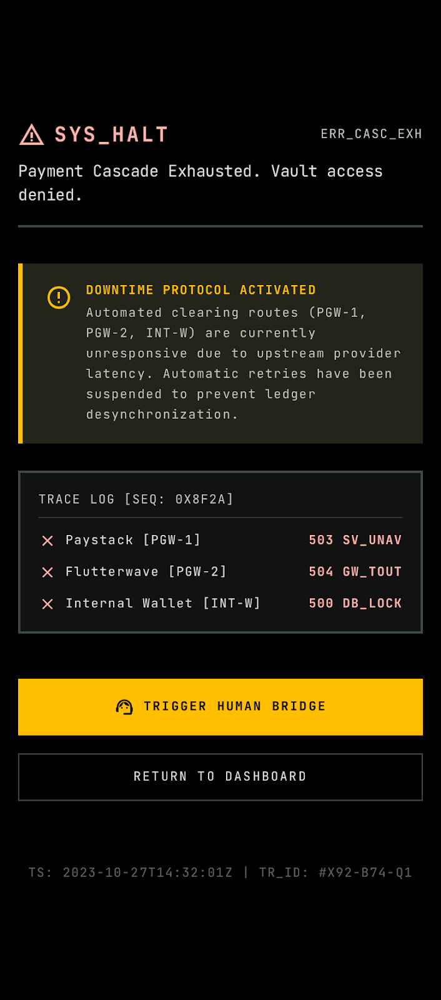
  &nbsp;&nbsp;
  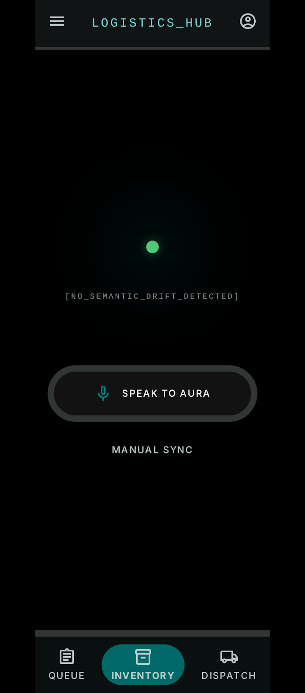
</p>

### Nexus Operations (Hub Manager Views)

<p align="center">
  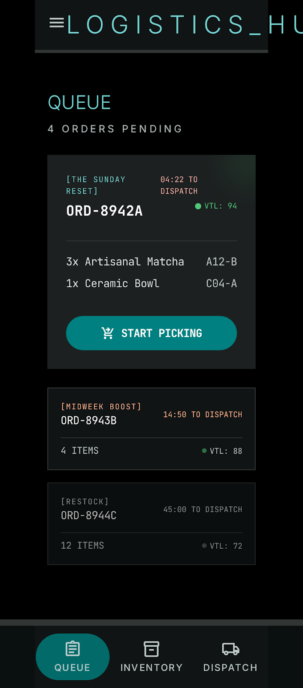
  &nbsp;&nbsp;
  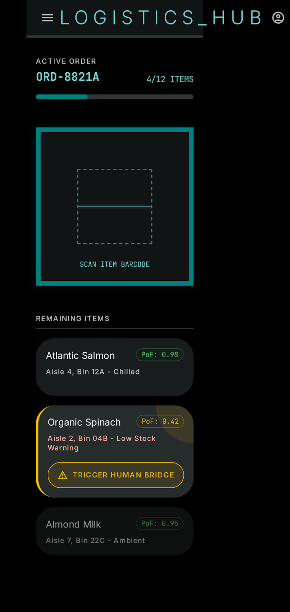
  &nbsp;&nbsp;
  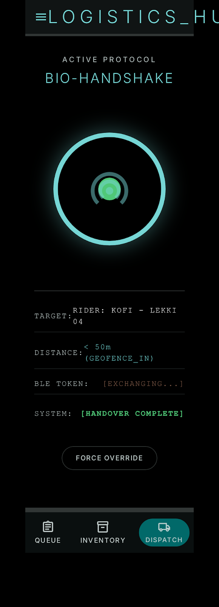
  &nbsp;&nbsp;
  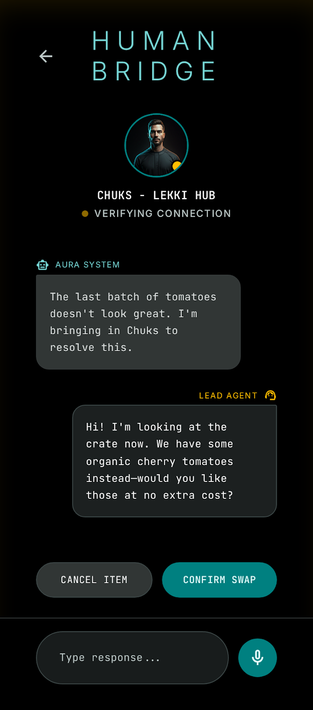
</p>

---

## Architecture

```
┌──────────────────────────────────────────────────────────────────────┐
│                       MOBILE CLIENT (Flutter)                        │
│  ┌──────────────┐  ┌──────────────┐  ┌─────────────────────────┐    │
│  │ SQLite-VEC   │  │ TFLite       │  │ Impeller Engine         │    │
│  │ (Encrypted)  │  │ (Wake-word,  │  │ (120fps Morphing UI)    │    │
│  │ Trust-Gated  │  │  Offline AI) │  │ GLSL Breathing Wave     │    │
│  └──────────────┘  └──────────────┘  └─────────────────────────┘    │
└──────────────────────────┬───────────────────────────────────────────┘
                           │ WebSocket (circuit-breaker protected)
                           ▼
              ┌────────────────────────┐
              │  GO ORCHESTRATOR       │
              │  Session Recovery      │  ← Redis snapshots every 5s
              │  Circuit Breakers      │  ← Per-service (5 failures/60s)
              │  PII Stripping         │
              │  OpenTelemetry Traces  │  ← Jaeger + Prometheus
              └─────────┬──────────────┘
                        │
          ┌─────────────┴─────────────┐
          ▼                           ▼
┌──────────────────┐      ┌───────────────────┐
│ PYTHON INTENT    │      │ PAYMENT CASCADE   │
│ ENGINE (FastAPI)  │      │ ROUTER            │
│ Whisper (Nigerian)│      │ Paystack →        │
│ Ambiguity Resolve│      │ Flutterwave →     │
│ Trust Ladder RAG │      │ Wallet →          │
│ Emotional State  │      │ Pay-on-Delivery   │
└────────┬─────────┘      └───────────────────┘
         │                     (16s total timeout)
         ▼
┌──────────────────┐
│ NODE.JS NEXUS API│
│ PoF Engine       │  ← Redis desync detection
│ 10 Chaos Protos  │
│ Fraud Detection  │  ← Velocity model
│ Single-Hub Policy│
└────────┬─────────┘
         │
    ┌────┴────┐
    ▼         ▼
 [MFC Hub]  [Rider Pulse App]
              │
         [Bio-Handshake]  ← 4-level cascade
              │
         [SOS Protocol]   ← Rider safety
```

| Layer | Technology | Key Features |
|-------|-----------|-------------|
| **Frontend** | Flutter + Impeller | 120fps UI, Bootstrap Dialogue, Trust Ladder UI, Degraded Handshake UI |
| **Edge AI** | SQLite-VEC + SQLCipher + TFLite | Trust-gated memory, 90-day pruning, corruption recovery |
| **Orchestrator** | Go | Circuit breakers, session crash recovery, Whisper confidence gating |
| **Intent Engine** | Python + FastAPI | Ambiguity Resolution, Trust Ladder context, Emotional State detection |
| **Nexus API** | Node.js + GraphQL | PoF engine, 10 Chaos Protocols, fraud detection, single-hub policy |
| **Rider App** | Flutter (lite) | SOS protocol, route safety, compensation engine, shift management |
| **Payments** | Microservice | 4-level cascade (16s total), Pay-on-Delivery fallback |
| **Observability** | Prometheus + Grafana + Jaeger | Distributed tracing, alerting, failure tolerance monitoring |

---

## Core Principles

| Principle | What It Means |
|-----------|--------------|
| **Zero-Click Priority** | If a recurring order needs > 2 taps, the UX has failed |
| **Zero Hallucination** | Aura never suggests an item not physically verified in the local hub |
| **Zero-Knowledge Intimacy** | Aura knows you deeply; Verve (the company) cannot access that data |
| **Graceful Degradation** | Fully functional on 3G, sub-15% battery, and during power outages |
| **Cognitive Relief** | We don't celebrate shopping — we celebrate time saved by not shopping |
| **Assume Continuous Failure** | Every component has a failure mode, a recovery path, and a circuit breaker |
| **Trust Is Earned** | Data access escalates through the Trust Ladder — never demanded upfront |

---

## Privacy & Security (The Guardian Protocol)

- 🔐 **Local-First Memory** — All personal context on-device in SQLite-VEC, encrypted with 256-bit AES
- 🔑 **Hardware-Backed Keys** — Encryption keys in Secure Enclave / Keystore. Never leave hardware.
- 🗑️ **Purge Protocol** — One tap destroys the key. Database becomes unreadable. Cloud webhook fires. Aura resets. Under 2 seconds.
- 🔇 **Audio Ephemerality** — Voice exists in RAM only. Transcribed and purged. Never on disk.
- 🛡️ **PII Stripping** — Names and GPS stripped before cloud LLM
- 🇳🇬 **NDPA Compliance** — PII on Nigerian-territory servers. BVN hashed locally.
- 🪜 **Trust Ladder Enforcement** — Data access enforced at the database query level, not just the UI

---

## Build Phases & Success Metrics

| Phase | Name | Weeks | Key Deliverables | Success Metrics |
|-------|------|-------|-----------------|-----------------|
| 1 | **Invisible Intelligence** | 1–4 | Voice loop, RAG, circuit breakers, session recovery | Voice-to-TTS < 1.2s, RAG recall > 90% |
| 2 | **Visual Stage** | 5–8 | Morphing Viewport, Bootstrap Dialogue, Trust Ladder UI, Verve+ | 60fps sustained, cold start < 1.5s |
| 3 | **Nexus Pilot** | 9–14 | Nexus API, 10 Chaos Protocols, Rider App, Bio-Handshake, Observability | 50+ deliveries, PoF > 95%, payments > 99% |
| 4 | **Guardian & Scale** | 15–20 | Privacy dashboard, failure tolerance validation, NDPA audit, soft launch | NPS > 70, 30-day retention > 40% |

**91 tasks** across 4 phases. **23 measurable success metrics.** **13 tracked risks.**

---

## Agentic Build System

Verve includes a **9-skill multi-agent orchestration framework** in [`.agents/`](.agents/) for AI-assisted development:

```
.agents/
├── manifest.json              # Project registry (v2.0.0)
├── state/build-state.json     # Persistent build state + metrics + risks
├── plans/                     # Auto-generated phase plans
├── reports/                   # Verification reports
├── context/                   # Compressed module summaries for agent memory
└── skills/
    ├── verve-conductor/       # 🎯 Master orchestrator — routes, gates, tracks
    ├── verve-planner/         # 📋 91-task decomposition across 4 phases
    ├── verve-cognitive-load/  # 🧠 Agent cognition rules (300-line limit, maps)
    ├── verve-flutter-builder/ # 📱 Consumer Flutter UI
    ├── verve-backend-builder/ # ⚙️ Go Orchestrator + Python Intent Engine
    ├── verve-nexus-builder/   # 🚚 Nexus API + Rider App + Chaos Protocols
    ├── verve-edge-builder/    # 🔐 Edge AI + encrypted local storage
    ├── verve-verifier/        # ✅ Quality gates + success metrics
    └── verve-memory/          # 💾 State, metrics, risks, Trust Ladder progress
```

### Cognitive Load Management

The build system enforces **agent-safe coding practices**:
- **300-Line Rule** — No source file exceeds 500 lines. Target 300. Plan splits at 250.
- **4-File Context Budget** — Never hold more than 4 files in active reasoning at once.
- **Structural Maps** — Every directory with 5+ files has a `_MAP.md` for instant orientation.
- **Context Summaries** — Compressed module representations for cross-session memory.

---

## Documentation

All specifications in [`docs/`](docs/):

| Document | Purpose |
|----------|---------|
| [Product Requirements](docs/Verve%20Product%20Requirements%20Document.md) | Features, cold start, revenue model, failure tolerances |
| [Core Blueprint](docs/Verve%20Core%20Blueprint.md) | Architecture, failure mode map, circuit breakers |
| [System Architecture](docs/Verve%20System%20Architecture.md) | Components, data flows, observability pipeline |
| [Build Strategy](docs/Verve%20Build%20Strategy%20%26%20Roadmap.md) | 4 phases, risk register, 23 success metrics |
| [Home Screen Spec](docs/Verve%20Home%20Screen%20Specification.md) | Morphing Viewport, shader specs |
| [Secondary Screens Spec](docs/Verve%20Secondary%20Screens%20Specification.md) | Guardian, Pantry, History, Payments |
| [Brand & Persona Manual](docs/Verve%20Brand%20%26%20Persona%20Manual.md) | Trust Ladder, Aura ambiguity resolution, emotional states |
| [Guardian Protocol](docs/Verve%20Guardian%20Protocol.md) | Privacy, Trust Ladder technical, degraded handshake cascade |
| [Nexus Operations Manual](docs/Verve%20Nexus%20Operations%20Manual.md) | 10 chaos protocols, rider safety, compensation |
| [Research & Analysis](docs/Verve%20Application%20Research%20and%20Analysis.md) | Market analysis, competitive landscape |

### Screen Designs

27 high-fidelity UI/UX screens in [`docs/screens/`](docs/screens/), each with `screen.png` and interactive `code.html`.

---

## Getting Started

### Prerequisites

| Tool | Version | Purpose |
|------|---------|---------|
| Flutter | 3.22+ | Mobile client (Impeller required) |
| Go | 1.22+ | Orchestrator middleware |
| Python | 3.11+ | Intent Engine (FastAPI) |
| Node.js | 20+ | Nexus API (GraphQL) |
| PostgreSQL | 16+ | Transactional data |
| Redis | 7+ | Live inventory cache + session snapshots |

### Clone & Explore

```bash
git clone https://github.com/ericfranzee/Verve.git
cd Verve

# Browse documentation
ls docs/

# Open any screen prototype
open docs/screens/verve_the_stage_hero_card_state/code.html
```

---

## Design System

| Token | Value | Usage |
|-------|-------|-------|
| **Aura Teal** | `#008080` | Primary brand, Idle wave, confirmations |
| **Nexus Amber** | `#FFBF00` | Warnings, substitutions, Human Bridge |
| **Vital Emerald** | `#50C878` | Success, payments, vitality scores |
| **Listening Cyan** | `#22D3EE` | Active listening state |
| **Background** | `#000000` | True black (OLED optimized) |
| **Primary Font** | Inter | Headers, conversational text |
| **Data Font** | JetBrains Mono | Receipts, Guardian Vault, ledger data |

---

## Contributing

Verve is open-source under **AGPL-3.0**. We welcome contributions across all layers.

### Areas Where Help Is Needed

- **Flutter Engineers** — Impeller shaders, Morphing Viewport, Bootstrap Dialogue
- **Go Engineers** — Circuit breakers, session recovery, WebSocket middleware
- **Python/AI Engineers** — Whisper fine-tuning for Nigerian English/Pidgin, Ambiguity Resolution
- **Node.js Engineers** — Nexus API, Chaos Protocol implementations, PoF engine
- **Mobile Security** — SQLCipher, Secure Enclave, Trust Ladder enforcement
- **Logistics Operators** — Rider safety protocols, hub operations, compensation models
- **Nigerian Market Expertise** — Local logistics, payment infrastructure, cultural nuance

### How to Contribute

1. **Read the docs** — Start with the [PRD](docs/Verve%20Product%20Requirements%20Document.md) and [Architecture](docs/Verve%20System%20Architecture.md)
2. **Pick a phase** — Check the [Build Strategy](docs/Verve%20Build%20Strategy%20%26%20Roadmap.md) for priorities
3. **Use the skills** — The `.agents/skills/` system guides implementation
4. **Submit a PR** — Reference the task ID (e.g., `P1-T07`)

---

## An Invitation

Verve is more than a codebase — it's a blueprint for what commerce should look like when infrastructure is hostile and trust is earned, not assumed.

Every specification has been written to engineering-ready depth. Every screen has been designed to production fidelity. The architecture accounts for the chaos of Lagos — fuel scarcity, power cuts, flooding, fraud, and the beautiful complexity of human behavior.

**What's missing is builders.**

If you believe an AI shouldn't just show you a product grid — it should *provision your life* — then Verve is your project. Whether you're a Flutter shader specialist in Berlin, a Go systems engineer in Nairobi, a Python ML engineer in Lagos, or a logistics operator in Abuja, there is a seat at this table.

9 agentic skills. 91 planned tasks. 23 success metrics. 10 chaos protocols. 4 build phases.

**The documents are ready. The architecture is hardened. The chaos is mapped. Let's build.**

---

<p align="center">
  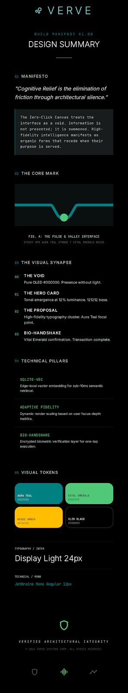
</p>

<p align="center">
  <strong>VERVE</strong> · Cognitive Commerce · Lagos / Abuja<br/>
  <em>Built for the future of African retail</em>
</p>

---

## License

This project is licensed under the **GNU Affero General Public License v3.0** — see the [LICENSE](LICENSE) file for details.

- ✅ You can use, modify, and distribute this software freely
- ✅ You can use it commercially
- ⚠️ If you modify and deploy it as a network service, you must release your source code
- ⚠️ All derivative works must also be AGPL-3.0 licensed

---

<p align="center">
  <sub>© 2026 Eric Franzee · Made with conviction in Nigeria</sub>
</p>
